> Early-stage project. Latest stable release is **v0.1.17**; everything after v0.1.17 is experimental while we migrate sh/ps1 build and release scripts to Dart hooks where compatible.

<p align="center">
  
</p>

<h1 align="center">Agus Maps Flutter</h1>

<p align="center">
  <strong>High-performance offline maps for Flutter, powered by the CoMaps/Organic Maps rendering engine.</strong>
</p>

<p align="center">
  <a href="#demos">Demos</a> •
  <a href="#quick-start">Quick Start</a> •
  <a href="#comparison">Comparison</a> •
  <a href="#documentation">Docs</a> •
  <a href="doc/API.md#future-api-candidates">Roadmap</a>
</p>

## What is Agus Maps?

Agus Maps Flutter is a **native Flutter plugin** that embeds the powerful [CoMaps](https://codeberg.org/comaps/comaps) rendering engine directly into your Flutter app. Unlike tile-based solutions, it renders **vector maps** with zero-copy GPU acceleration, delivering smooth 60fps performance even on low-end devices.

> **Note:** Agus Maps follows the **CoMaps** implementation specifically. While CoMaps shares historical heritage with [Organic Maps](https://organicmaps.app/) and the original MAPS.ME, we track CoMaps as our upstream reference. CoMaps is actively developed with a focus on community-driven improvements and modern tooling.

### 🗺️ New to CoMaps? Try it First!

If you're not familiar with CoMaps, we highly recommend installing it on your phone first to experience the magic firsthand — available on [iOS (App Store)](https://apps.apple.com/us/app/comaps/id6747180809) and [Android (Google Play)](https://play.google.com/store/apps/details?id=app.comaps.google&pcampaignid=web_share).

**Here's how CoMaps works:**

1. **Start with a world overview** — When you first open CoMaps, you get a low-resolution map of the entire world. This lets you navigate and explore at a global scale without downloading gigabytes of data.

2. **Zoom in to discover regions** — As you zoom into a specific area (say, your city or a travel destination), CoMaps notices you might want more detail and invites you to download that region's map.

3. **Download once, use forever offline** — After downloading a region (which typically takes just seconds to a few minutes depending on size), you now have a fully detailed, high-resolution offline copy of that entire area. No internet needed!

4. **Explore with incredible detail** — Street names, hiking trails, building outlines, cafes, transit stops—all available offline with smooth panning and zooming.

**So what's the point of this plugin?**

CoMaps is a fantastic standalone app, but what if you want to embed this same powerful offline mapping experience *inside your own Flutter app*? That's exactly what Agus Maps Flutter does! 🎉

With this plugin, you can:
- **Bundle specific region maps** with your app (pre-downloaded, ready to go on first launch)
- **Let users download additional regions** as needed through an in-app UI
- **Display fully interactive, offline-capable maps** as a Flutter widget

**Example use case:** Imagine building a **bus route app** for a specific city. Pre-bundle that city's map file with your app, and your users get instant offline maps—no API keys, no usage fees, no internet required. The map widget integrates seamlessly with your custom UI and business logic.

> **💡 Tip:** Keep maps fresh by pushing updates through App Store/Play Store releases, or [host your own map server](#host-your-own-map-server-recommended-for-production) for full control over regions and update cycles.

Other ideas: hiking apps, travel guides, field data collection, emergency services, tourism kiosks—the possibilities are endless!

> **📜 Licensing:** Agus Maps Flutter is released under the [Apache 2.0 License](LICENSE). Please review our [NOTICE](NOTICE) file for attribution requirements and third-party dependencies. **We recommend consulting with a legal professional** to understand how these licenses apply to your specific use case.

### 🚧 Current Status: Proof of Concept

This project is currently in the **proof of concept stage**, demonstrating zero-copy (or optimized) rendering integration between the CoMaps engine and Flutter's texture system. The [example app](example/) successfully runs on:

| Platform | Status | Notes |
|----------|--------|-------|
| **iOS** | ✅ Working | arm64, x86_64 simulator |
| **macOS** | ✅ Working | arm64/x86_64, window resize supported |
| **Android** | ✅ Working | arm64-v8a, armeabi-v7a, x86_64 |
| **Windows** | ✅ Working | x86_64 only |
| **Linux** | ✅ Working | x86_64 with EGL/GLES3, tested on WSL2 |
| **Windows ARM64** | 🚧 Planned | Blocked on dedicated hardware |

Contributions for Windows ARM64 are welcome from developers with access to the required hardware!

### Why Another Map Plugin?

Most Flutter map solutions either:
- Render tiles in Dart (slow, GC pressure, jank on older devices)
- Use PlatformView embedding (performance overhead, gesture conflicts, "airspace" issues)

**Agus Maps takes a different approach:** The C++ rendering engine draws directly to a GPU texture that Flutter composites natively—no copies, no bridges, no compromises.

## Demos

The following videos showcase the **Agus Maps plugin** running on various platforms. To explore the reference implementation producing these results, check out the [example app](example/) source code.

<table>
  <tr>
    <td align="center" width="50%">
      <a href="https://youtu.be/YVaBJ8uW5Ag">
        
        <br><strong>📱 Android</strong>
      </a>
    </td>
    <td align="center" width="50%">
      <a href="https://youtu.be/Jt0QE9Umsng">
        
        <br><strong>📱 iOS</strong>
      </a>
    </td>
  </tr>
  <tr>
    <td align="center" width="50%">
      <a href="https://youtu.be/Gd53HFrAGts">
        
        <br><strong>🖥️ macOS</strong>
      </a>
    </td>
    <td align="center" width="50%">
      <a href="https://youtu.be/SWoLl-700LM">
        
        <br><strong>🪟 Windows</strong>
      </a>
    </td>
  </tr>
</table>
<table>
  <tr>
    <td align="center" width="50%">
      <a href="https://youtu.be/Uxb_1o9dFao">
        
        <br><strong>🐧 Linux</strong>
      </a>
    </td>
    <td width="50%"></td>
  </tr>
</table>

## Quick Start

> **Note:** Agus Maps Flutter is a **plugin/package** that you integrate into your own Flutter app—we are not building a standalone map application. The [example app](example/) demonstrates how to use the plugin and serves as a reference implementation.

### Installation

#### Step 1: Add the Plugin Dependency

Add `agus_maps_flutter` to your `pubspec.yaml`:

```yaml
dependencies:
  agus_maps_flutter: ^X.Y.Z # see https://github.com/agus-works/agus-maps-flutter/releases
```

Run `flutter pub get` to download the plugin.

#### Step 2: Configure Minimum Platform Versions

Agus Maps Flutter requires specific minimum platform versions. **You must configure these in your Flutter app** before building.

**iOS (15.6+)**

Update your `ios/Podfile` to specify the minimum iOS version:

```ruby
platform :ios, '15.6'
```

The plugin's podspec enforces iOS 15.6, but explicitly setting it in your Podfile ensures consistency. After updating, run:

```bash
cd ios
pod install
cd ..
```

**macOS (12.0+)**

Update your `macos/Podfile` to specify the minimum macOS version:

```ruby
platform :osx, '12.0'
```

The plugin's podspec enforces macOS 12.0. After updating, run:

```bash
cd macos
pod install
cd ..
```

**Android (API 24+)**

**⚠️ Critical:** You must set `minSdk = 24` in your app's `android/app/build.gradle` or `android/app/build.gradle.kts`:

**Groovy (build.gradle):**
```groovy
android {
    defaultConfig {
        minSdkVersion 24
        // ... other config
    }
}
```

**Kotlin DSL (build.gradle.kts):**
```kotlin
android {
    defaultConfig {
        minSdk = 24
        // ... other config
    }
}
```

> **Note:** If your app's `minSdk` is lower than 24, the build will fail. The plugin requires Android API 24 (Android 7.0 Nougat) or higher.

#### Step 3: Download the SDK

Since `agus-maps-flutter` contains a high-performance C++ engine, users must manually download the pre-compiled SDK to match their plugin version.

1. Go to [GitHub Releases](https://github.com/agus-works/agus-maps-flutter/releases).
2. Download `agus-maps-sdk-vX.Y.Z.zip` for the version you are using.
3. Extract this zip file to a location on your machine (e.g., `~/agus-sdk` or `C:\agus-sdk`).

#### Step 4: Set Environment Variable

You must set the `AGUS_MAPS_HOME` environment variable to point to the extracted SDK directory.

**macOS/Linux:**
```bash
export AGUS_MAPS_HOME=/path/to/agus-maps-sdk-vX.Y.Z
```

**Windows (PowerShell):**
```powershell
$env:AGUS_MAPS_HOME = "C:\path\to\agus-maps-sdk-vX.Y.Z"
```

**Windows (CMD):**
```cmd
set AGUS_MAPS_HOME=C:\path\to\agus-maps-sdk-vX.Y.Z
```

> **Tip:** Add this to your shell profile (`.bashrc`, `.zshrc`, PowerShell profile) so it persists across terminal sessions.

#### Step 5: Copy Assets

Copy the `assets` folder from the SDK into your Flutter app's root directory.

```bash
# MacOS/Linux
cp -r $AGUS_MAPS_HOME/assets/ my_flutter_app/assets/

# Windows
Copy-Item -Recurse "$env:AGUS_MAPS_HOME\assets" "my_flutter_app\assets"
```

Then add the assets to your `pubspec.yaml`. For now, there are a lot of assets that needs to be added. This is the way until we figure out a better way to do this.

```yaml
flutter:
  assets:
    # sensible default embedded
    - assets/maps/World.mwm
    - assets/maps/WorldCoasts.mwm
    # default regions pre-loaded. optional!
    - assets/maps/Philippines_Luzon_Manila.mwm
    - assets/maps/Philippines_Luzon_North.mwm
    - assets/maps/Philippines_Luzon_South.mwm
    - assets/maps/Philippines_Mindanao.mwm
    - assets/maps/Philippines_Visayas.mwm
    # everything below seems to be required.
    - assets/maps/icudt75l.dat
    - assets/comaps_data/
    - assets/comaps_data/fonts/
    - assets/comaps_data/categories-strings/ar.json/
    - assets/comaps_data/categories-strings/be.json/
    - assets/comaps_data/categories-strings/bg.json/
    - assets/comaps_data/categories-strings/ca.json/
    - assets/comaps_data/categories-strings/cs.json/
    - assets/comaps_data/categories-strings/da.json/
    - assets/comaps_data/categories-strings/de.json/
    - assets/comaps_data/categories-strings/el.json/
    - assets/comaps_data/categories-strings/en-AU.json/
    - assets/comaps_data/categories-strings/en-GB.json/
    - assets/comaps_data/categories-strings/en-US.json/
    - assets/comaps_data/categories-strings/en.json/
    - assets/comaps_data/categories-strings/es-MX.json/
    - assets/comaps_data/categories-strings/es.json/
    - assets/comaps_data/categories-strings/et.json/
    - assets/comaps_data/categories-strings/eu.json/
    - assets/comaps_data/categories-strings/fa.json/
    - assets/comaps_data/categories-strings/fi.json/
    - assets/comaps_data/categories-strings/fr.json/
    - assets/comaps_data/categories-strings/he.json/
    - assets/comaps_data/categories-strings/hi.json/
    - assets/comaps_data/categories-strings/hu.json/
    - assets/comaps_data/categories-strings/id.json/
    - assets/comaps_data/categories-strings/it.json/
    - assets/comaps_data/categories-strings/ja.json/
    - assets/comaps_data/categories-strings/ko.json/
    - assets/comaps_data/categories-strings/lv.json/
    - assets/comaps_data/categories-strings/mr.json/
    - assets/comaps_data/categories-strings/nb.json/
    - assets/comaps_data/categories-strings/nl.json/
    - assets/comaps_data/categories-strings/pl.json/
    - assets/comaps_data/categories-strings/pt-BR.json/
    - assets/comaps_data/categories-strings/pt.json/
    - assets/comaps_data/categories-strings/ro.json/
    - assets/comaps_data/categories-strings/ru.json/
    - assets/comaps_data/categories-strings/sk.json/
    - assets/comaps_data/categories-strings/sr.json/
    - assets/comaps_data/categories-strings/sv.json/
    - assets/comaps_data/categories-strings/sw.json/
    - assets/comaps_data/categories-strings/th.json/
    - assets/comaps_data/categories-strings/tr.json/
    - assets/comaps_data/categories-strings/uk.json/
    - assets/comaps_data/categories-strings/vi.json/
    - assets/comaps_data/categories-strings/zh-Hans.json/
    - assets/comaps_data/categories-strings/zh-Hant.json/
    - assets/comaps_data/countries-strings/ar.json/
    - assets/comaps_data/countries-strings/ast.json/
    - assets/comaps_data/countries-strings/az.json/
    - assets/comaps_data/countries-strings/be.json/
    - assets/comaps_data/countries-strings/ca.json/
    - assets/comaps_data/countries-strings/cs.json/
    - assets/comaps_data/countries-strings/cy.json/
    - assets/comaps_data/countries-strings/da.json/
    - assets/comaps_data/countries-strings/de.json/
    - assets/comaps_data/countries-strings/default.json/
    - assets/comaps_data/countries-strings/el.json/
    - assets/comaps_data/countries-strings/en.json/
    - assets/comaps_data/countries-strings/es.json/
    - assets/comaps_data/countries-strings/et.json/
    - assets/comaps_data/countries-strings/eu.json/
    - assets/comaps_data/countries-strings/fa.json/
    - assets/comaps_data/countries-strings/fi.json/
    - assets/comaps_data/countries-strings/fr.json/
    - assets/comaps_data/countries-strings/he.json/
    - assets/comaps_data/countries-strings/hu.json/
    - assets/comaps_data/countries-strings/ia.json/
    - assets/comaps_data/countries-strings/id.json/
    - assets/comaps_data/countries-strings/it.json/
    - assets/comaps_data/countries-strings/ja.json/
    - assets/comaps_data/countries-strings/kab.json/
    - assets/comaps_data/countries-strings/ko.json/
    - assets/comaps_data/countries-strings/lt.json/
    - assets/comaps_data/countries-strings/mr.json/
    - assets/comaps_data/countries-strings/nb.json/
    - assets/comaps_data/countries-strings/nl.json/
    - assets/comaps_data/countries-strings/pl.json/
    - assets/comaps_data/countries-strings/pt.json/
    - assets/comaps_data/countries-strings/ro.json/
    - assets/comaps_data/countries-strings/ru.json/
    - assets/comaps_data/countries-strings/sk.json/
    - assets/comaps_data/countries-strings/sr.json/
    - assets/comaps_data/countries-strings/sr_Latn.json/
    - assets/comaps_data/countries-strings/sv.json/
    - assets/comaps_data/countries-strings/th.json/
    - assets/comaps_data/countries-strings/tr.json/
    - assets/comaps_data/countries-strings/uk.json/
    - assets/comaps_data/countries-strings/vi.json/
    - assets/comaps_data/countries-strings/zh-Hans.json/
    - assets/comaps_data/countries-strings/zh-Hant.json/
    - assets/comaps_data/symbols/
    - assets/comaps_data/symbols/6plus/
    - assets/comaps_data/symbols/6plus/dark/
    - assets/comaps_data/symbols/6plus/light/
    - assets/comaps_data/symbols/default/
    - assets/comaps_data/symbols/hdpi/
    - assets/comaps_data/symbols/hdpi/dark/
    - assets/comaps_data/symbols/hdpi/light/
    - assets/comaps_data/symbols/mdpi/
    - assets/comaps_data/symbols/mdpi/dark/
    - assets/comaps_data/symbols/mdpi/light/
    - assets/comaps_data/symbols/xhdpi/
    - assets/comaps_data/symbols/xhdpi/dark/
    - assets/comaps_data/symbols/xhdpi/light/
    - assets/comaps_data/symbols/xxhdpi/
    - assets/comaps_data/symbols/xxhdpi/dark/
    - assets/comaps_data/symbols/xxhdpi/light/
    - assets/comaps_data/symbols/xxxhdpi/
    - assets/comaps_data/symbols/xxxhdpi/dark/
    - assets/comaps_data/symbols/xxxhdpi/light/
    - assets/comaps_data/styles/
    - assets/comaps_data/styles/default/
    - assets/comaps_data/styles/default/include/
    - assets/comaps_data/styles/default/light/
    - assets/comaps_data/styles/default/light/symbols/
    - assets/comaps_data/styles/default/light/symbols-ad/
    - assets/comaps_data/styles/default/dark/
    - assets/comaps_data/styles/default/dark/symbols/
    - assets/comaps_data/styles/default/dark/symbols-ad/
    - assets/comaps_data/styles/vehicle/
    - assets/comaps_data/styles/vehicle/include/
    - assets/comaps_data/styles/vehicle/light/
    - assets/comaps_data/styles/vehicle/dark/
    - assets/comaps_data/styles/outdoors/
    - assets/comaps_data/styles/outdoors/include/
    - assets/comaps_data/styles/outdoors/light/
```

#### Step 6: Build and Run

```bash
flutter run
```

The build system will automatically find the binaries and headers using `AGUS_MAPS_HOME`.

### Quick Test: Quickstart Example App

Before integrating Agus Maps into your own Flutter app, you can test your development environment by downloading and building the **compact quickstart example app**:

**Download:** [Quickstart Example App (vX.Y.Z)](https://bit.ly/3NcQeMi)

This is a simple Flutter app that demonstrates the basic Agus Maps integration and can help verify that your setup is correct for any supported platform target (Android, iOS, macOS, Windows, or Linux).

**Requirements:**
- Follow **Steps 1-4** above (add plugin dependency, configure platform versions, download SDK, set `AGUS_MAPS_HOME`)
- Extract the quickstart app archive
- Set `AGUS_MAPS_HOME` to point to your extracted SDK directory (same as Step 4)
- Build and run for your target platform:
  ```bash
  flutter run -d <device>
  ```

> **Note:** The quickstart app requires a valid `AGUS_MAPS_HOME` environment variable pointing to the extracted SDK directory (see Step 4 above). If the build fails, verify that `AGUS_MAPS_HOME` is set correctly and the SDK binaries are present.

If you can successfully build and run the quickstart app, your development environment is correctly configured and ready for integrating Agus Maps into your own Flutter application!

### Upgrading the Plugin

> **⚠️ Important:** When upgrading `agus_maps_flutter` to a new version, you must also **download the new SDK** and update your `AGUS_MAPS_HOME` variable.

**Upgrade steps:**

1. Update the version in your `pubspec.yaml`:
   ```yaml
   dependencies:
     agus_maps_flutter: ^X.Y.Z  # New version
   ```

2. Run `flutter pub get`

3. Download the **matching** SDK (`agus-maps-sdk-vX.Y.Z.zip`) from [GitHub Releases](https://github.com/agus-works/agus-maps-flutter/releases).

4. Extract it to a new directory (e.g., `agus-maps-sdk-vX.Y.Z`).

5. Update your environment variable `AGUS_MAPS_HOME` to point to the new directory.

6. **Copy the new assets** to your app root (overwriting old ones).

7. **Clear cached headers** (iOS/macOS only):
   ```bash
   # Clear stale headers from pub cache
   rm -rf ~/.pub-cache/hosted/pub.dev/agus_maps_flutter-*/macos/Headers
   rm -rf ~/.pub-cache/hosted/pub.dev/agus_maps_flutter-*/macos/Frameworks
   rm -rf ~/.pub-cache/hosted/pub.dev/agus_maps_flutter-*/ios/Headers
   rm -rf ~/.pub-cache/hosted/pub.dev/agus_maps_flutter-*/ios/Frameworks
   ```

8. Rebuild your app:
   ```bash
   flutter clean
   flutter pub get
   
   # For macOS:
   cd macos && AGUS_MAPS_HOME=/path/to/new-sdk pod install && cd ..
   
   # For iOS:
   cd ios && AGUS_MAPS_HOME=/path/to/new-sdk pod install && cd ..
   
   flutter run
   ```

> **⚠️ iOS/macOS Note:** The plugin caches native headers from `AGUS_MAPS_HOME` during `pod install`. When upgrading SDK versions or switching SDK paths, you **must** clear the cached headers (step 7) to avoid build failures with "file not found" errors. See [Troubleshooting](doc/RELEASE.md#clearing-cached-headers-when-switching-sdk-versions) for details.

### Alternative: Vendored Plugin

For projects that need to vendor the plugin locally (offline builds, custom modifications):

1. Clone or download the plugin into your project:
   ```bash
   cd your_app
   mkdir packages
   git clone https://github.com/agus-works/agus-maps-flutter.git packages/agus_maps_flutter
   ```

2. Download and extract the SDK to a global location:
   ```bash
   curl -L -o sdk.zip https://github.com/agus-works/agus-maps-flutter/releases/download/vX.Y.Z/agus-maps-sdk-vX.Y.Z.zip
   unzip sdk.zip -d ~/agus-sdk
   export AGUS_MAPS_HOME=~/agus-sdk/agus-maps-sdk-vX.Y.Z
   ```

3. Reference the local plugin in your `pubspec.yaml`:
   ```yaml
   dependencies:
     agus_maps_flutter:
       path: packages/agus_maps_flutter
   ```

4. Copy assets to your app:
   ```bash
   cp -r $AGUS_MAPS_HOME/assets/comaps_data assets/
   cp -r $AGUS_MAPS_HOME/assets/maps assets/
   ```

5. Add assets to your `pubspec.yaml` and build.

> **Note:** The `assets/maps/` directory contains the ICU data file and is where downloaded MWM map files will be stored. You can pre-bundle specific region maps here.

### Basic Usage

```dart
import 'package:agus_maps_flutter/agus_maps_flutter.dart';

// Initialize the engine (call once at app startup)
await agus_maps_flutter.initWithPaths(dataPath, dataPath);
agus_maps_flutter.loadMap(mapFilePath);

// Add the map widget
AgusMap(
  initialLat: 36.1408,
  initialLon: -5.3536,
  initialZoom: 14,
  userScale: 1.0, // Optional: adjust label scale (DPI-aware)
  onMapReady: () => print('Map is ready!'),
)
```

### Programmatic Control

```dart
final controller = AgusMapController();

AgusMap(
  controller: controller,
  // ...
)

// Move the map
controller.moveToLocation(40.4168, -3.7038, 12);
```

See the [example app](example/) for a complete working demo showing all plugin features.

> **For Plugin Users:** The example app source code in `./example/` is your best reference for integrating Agus Maps into your own Flutter application.

<h2 id="comparison">Comparison with Other Solutions</h2>

| Feature | Agus Maps | flutter_map | google_maps_flutter | mapbox_gl |
|---------|-----------|-------------|---------------------|-----------|
| **Rendering** | Native GPU (zero-copy*) | Dart/Skia | PlatformView | PlatformView |
| **Offline Support** | ✅ Full | ✅ With tiles | ❌ Limited | ✅ With SDK |
| **Performance** | ⭐⭐⭐⭐⭐ | ⭐⭐⭐ | ⭐⭐⭐⭐ | ⭐⭐⭐⭐ |
| **Memory Usage** | Very Low | High (GC) | Medium | Medium |
| **License** | Apache 2.0 | BSD | Proprietary | Proprietary |
| **Pricing** | Free | Free | Usage-based | Usage-based |
| **Data Source** | OpenStreetMap | Any tiles | Google | Mapbox |
| **Widget Integration** | ✅ Native | ✅ Native | ⚠️ PlatformView | ⚠️ PlatformView |
| **Platforms** | Android, iOS, macOS, Windows, Linux | All | Android, iOS | Android, iOS |

*\*Zero-copy on iOS, macOS, Android. Windows uses WGL_NV_DX_interop when available (otherwise CPU copy). Linux uses CPU-mediated transfer.*

### Platform Support

| Platform | Architecture | Rendering | Zero-Copy |
|----------|--------------|-----------|-----------|
| **iOS** | arm64, x86_64 (sim) | Metal | ✅ Yes (IOSurface) |
| **macOS** | arm64, x86_64 | Metal | ✅ Yes (IOSurface) |
| **Android** | arm64-v8a, armeabi-v7a, x86_64 | OpenGL ES | ✅ Yes (SurfaceTexture) |
| **Windows** | x86_64 only | OpenGL + D3D11 | ⚠️ Conditional (WGL_NV_DX_interop or CPU copy) |
| **Linux** | x86_64 | EGL + OpenGL ES 3.0 | ❌ No (CPU-mediated) |

> **Windows/Linux Note:** ARM64 Windows (Snapdragon X, etc.) is not currently supported due to lack of testing hardware. Windows uses WGL_NV_DX_interop for zero-copy when supported by the driver; otherwise it falls back to CPU-mediated `glReadPixels()` (~2-5ms per frame). Linux uses `FlPixelBufferTexture` - zero-copy texture sharing isn't available because Flutter's Linux embedder doesn't support direct GL texture sharing. See [Linux Implementation](doc/IMPLEMENTATION-LINUX.md) for details. Contributions welcome!

### Pros ✅

- **Truly offline** — No API keys, no usage limits, no internet dependency
- **Best-in-class performance** — The battle-tested Drape engine, refined through MAPS.ME → Organic Maps → CoMaps
- **Privacy-first** — No telemetry, no tracking, data stays on device
- **Compact map files** — Entire countries in tens of MB (Germany ~800MB, Gibraltar ~1MB)
- **Free forever** — Open source, Apache 2.0 license
- **Flutter-native composition** — No PlatformView overhead, works perfectly with overlays

### Cons ⚠️

- **Limited styling** — Uses Organic Maps' cartographic style (not customizable yet)
- **No real-time traffic** — Offline-first design means no live data
- **Windows zero-copy (conditional)** — Uses WGL_NV_DX_interop when available; otherwise falls back to CPU copy
- **Windows x86_64 only** — ARM64 Windows not yet supported
- **MWM format required** — Must use pre-generated map files (not arbitrary tile servers)
- **Early stage** — Search and routing APIs not yet exposed

## Why It's Efficient

Agus Maps achieves excellent performance on older devices (tested on Samsung Galaxy S10) through architectural choices that minimize resource usage:

| Aspect | How We Achieve It | Learn More |
|--------|-------------------|------------|
| **Memory** | Memory-mapped files (mmap) — only viewed tiles loaded into RAM | [Details](doc/ARCHITECTURE-ANDROID.md#memory-efficiency) |
| **Battery** | Event-driven rendering — CPU/GPU sleep when map is idle | [Details](doc/ARCHITECTURE-ANDROID.md#battery-efficiency) |
| **CPU** | Multi-threaded — heavy work on background threads, UI never blocked | [Details](doc/ARCHITECTURE-ANDROID.md#processor-efficiency) |
| **Startup** | One-time asset extraction, cached on subsequent launches | [Details](doc/IMPLEMENTATION-ANDROID.md) |

### Zero-Copy Architecture (iOS, macOS, Android)


| | Traditional Map App | Agus Maps |
|--|---------------------|------------|
| **RAM Usage** | ~100MB | ~20MB |
| **Behavior** | Always polling | Sleep when idle |

### Windows Architecture (x86_64)

Windows prefers zero-copy via **WGL_NV_DX_interop**. This allows direct GPU-to-GPU memory sharing between OpenGL (CoMaps) and DirectX 11 (Flutter).

**Primary Zero-Copy Pipeline:**


**Fallback CPU Pipeline** (used if interop is unavailable):

```mermaid
flowchart TB
    subgraph pipeline["Fallback Path"]
        direction TB
        W1["CoMaps<br/>(OpenGL via WGL)"] 
        W1 -->|"glReadPixels<br/>(GPU→CPU, ~2-5ms)"| W2["CPU Buffer<br/>(RGBA→BGRA + Y-flip)"]
        W2 -->|"D3D11 staging texture"| W3["D3D11 Shared Texture<br/>(DXGI handle)"]
        W3 -->|"Zero-copy to Flutter"| W4["Flutter Texture Widget"]
    end
```


> **Performance:** Still achieves 60fps on modern hardware with ~30-40MB RAM for the rendering pipeline.

> **Note:** The map data itself (MWM files) still uses memory-mapping. The CPU-mediated transfer only affects frame display and is used only when WGL_NV_DX_interop is unavailable.

### Windows Diagnostics Overlay (Native)

Windows builds include a small, native overlay rendered by OpenGL into the map texture (upper-right corner) to show the active renderer and transfer path:

- `Renderer: OpenGL (WGL)`
- `Transfer: Zero-copy (WGL_NV_DX_interop)` **or** `Transfer: CPU copy (glReadPixels)`
- `Keyed mutex: On/Off`

Disable the overlay by setting:
- `AGUS_MAPS_WIN_OVERLAY=0`

Developers can add custom overlay lines by calling `AgusWglContextFactory::SetOverlayCustomLines()` in the native layer.

## Documentation

| Document | Description |
|----------|-------------|
| [GUIDE.md](GUIDE.md) | Architectural blueprint and design philosophy |
| [doc/API.md](doc/API.md) | **API Reference** - All existing APIs exposed to Flutter and roadmap for future additions |
| [doc/ARCHITECTURE-ANDROID.md](doc/ARCHITECTURE-ANDROID.md) | Deep dive: memory efficiency, battery savings, how it works |
| [doc/COMAPS-ASSETS.md](doc/COMAPS-ASSETS.md) | **CoMaps asset management:** data files, localization, MWM maps |
| [doc/IMPLEMENTATION-ANDROID.md](doc/IMPLEMENTATION-ANDROID.md) | Android build instructions, debug/release modes |
| [doc/IMPLEMENTATION-IOS.md](doc/IMPLEMENTATION-IOS.md) | iOS build instructions and Metal integration |
| [doc/IMPLEMENTATION-MACOS.md](doc/IMPLEMENTATION-MACOS.md) | macOS build instructions, window resize handling |
| [doc/IMPLEMENTATION-WIN.md](doc/IMPLEMENTATION-WIN.md) | Windows build instructions, x86_64 only |
| [doc/RENDER-LOOP.md](doc/RENDER-LOOP.md) | Render loop comparison across all platforms |
| [doc/CONTRIBUTING.md](doc/CONTRIBUTING.md) | Developer setup, commit guidelines, known issues |
| [example/](example/) | Working demo application with downloads manager |

### Technical Deep Dives

For those who want to understand *why* Agus Maps is efficient:

- **[How Memory Mapping Works](doc/ARCHITECTURE-ANDROID.md#memory-efficiency)** — Why we use 10x less RAM than tile-based solutions
- **[Battery Efficiency](doc/ARCHITECTURE-ANDROID.md#battery-efficiency)** — Event-driven rendering that sleeps when idle
- **[Multi-threaded Architecture](doc/ARCHITECTURE-ANDROID.md#processor-efficiency)** — How we keep the UI thread responsive
- **[Old Phone Compatibility](doc/ARCHITECTURE-ANDROID.md#why-this-works-on-older-phones)** — Tested on Samsung Galaxy S10 and similar devices

### Known Issues & Optimization Opportunities

We track efficiency-related issues in dedicated files. See [CONTRIBUTING.md](doc/CONTRIBUTING.md#known-issues) for the full list, including:

- Debug logging overhead in release builds
- EGL context recreation on app resume
- Touch event throttling considerations

## Roadmap

See **[API.md](doc/API.md#future-api-candidates)** for detailed roadmap of planned API features including search, routing, bookmarks, location services, and more. The roadmap includes implementation priority recommendations and difficulty assessments.

## Map Data

Agus Maps uses MWM files from OpenStreetMap, hosted on the official CoMaps CDN servers.

### CoMaps CDN Servers

The CoMaps CDN provides MWM files with enhanced features not available in older Organic Maps mirrors:
- Improved routing engine with conditional restrictions
- More dense altitude contour lines
- Additional POIs (EV charging stations, vending machines, etc.)
- Enhanced map colors for light/dark modes
- Better search functionality

| Server | URL | Notes |
|--------|-----|-------|
| **CoMaps MapGen Finland** | `https://mapgen-fi-1.comaps.app/` | Primary (listed by metaserver) |
| **CoMaps CDN US** | `https://cdn-us-2.comaps.tech/` | |
| **CoMaps CDN Germany** | `https://comaps.firewall-gateway.de/` | |

**URL Structure:** `<base>/maps/<version>/<file>`

Example: `https://mapgen-fi-1.comaps.app/maps/260101/Gibraltar.mwm`

> **Note:** The CoMaps metaserver at `https://cdn-us-1.comaps.app/servers` returns the currently active download servers.

### Diagnostic Tool

Run the mirror availability diagnostic tool to check server status:

```bash
dart run tool/check_mirrors.dart
```

### In-App Download
**In-app (Example)**: Use the example app's Downloads tab to browse and download regions. The app automatically selects the fastest available CoMaps CDN server.

The example app bundles a small Gibraltar map for testing.

### Host Your Own Map Server (Recommended for Production)

For production apps, we **strongly recommend** hosting your own MWM file server rather than relying on third-party mirrors. This gives you:
- **Reliability** — No dependency on external services
- **Control** — Update maps on your own schedule  
- **Customization** — Generate maps for specific regions or with custom data
- **Compliance** — Meet data residency requirements

#### Overview

The map generation pipeline consists of:
1. **Input Data**: OpenStreetMap `.osm.pbf` planet dumps (or regional extracts)
2. **Generator Tools**: C++ binaries (`generator_tool`, `world_roads_builder_tool`) built from CoMaps
3. **Python Driver**: `maps_generator` CLI that orchestrates the generation process
4. **Output**: `.mwm` binary map files ready for serving

#### Quick Start: Generate Maps for a Single Region

```bash
# 1. Clone CoMaps and build the generator tools
git clone https://codeberg.org/comaps/comaps.git
cd comaps
./tools/unix/build_omim.sh -r generator_tool
./tools/unix/build_omim.sh -r world_roads_builder_tool

# 2. Set up the Python environment
cd tools/python
pip install -r maps_generator/requirements_dev.txt
cp maps_generator/var/etc/map_generator.ini.default maps_generator/var/etc/map_generator.ini

# 3. Edit map_generator.ini:
#    - Set OMIM_PATH to your CoMaps repo root
#    - Set PLANET_URL to your regional .osm.pbf (e.g., from Geofabrik)
#    Example: PLANET_URL=https://download.geofabrik.de/europe/germany-latest.osm.pbf

# 4. Generate maps (example: Germany without coastlines)
python3 -m maps_generator --countries="Germany_*" --skip="Coastline"
```

Output files will be in `maps_build/YYYY_MM_DD__HH_MM_SS/YYMMDD/*.mwm`

#### Full Planet Generation (CI/CD Pipeline)

For automated full-planet generation, CoMaps uses a multi-stage Forgejo Actions workflow:

| Stage | Purpose | Resources |
|-------|---------|-----------|
| **update-planet-pbf** | Download/update OSM planet dump (~70GB) | `pyosmium-up-to-date` |
| **update-planet-o5m** | Convert PBF to O5M format for faster processing | `osmconvert`, `osmupdate` |
| **update-wiki** | Fetch Wikipedia descriptions for POIs | [wikiparser](https://codeberg.org/comaps/wikiparser) |
| **update-subways** | Generate metro/subway layer | [subways](https://codeberg.org/comaps/subways) |
| **update-tiger** | US address data from Nominatim | `address_parser_tool` |
| **update-isolines** | Altitude contour lines from SRTM | `topography_generator_tool` |
| **generate-maps** | Run the full map generation | `maps_generator` Python CLI |
| **upload-maps** | Upload to CDN servers via rclone | `rclone copy` |

**Hardware requirements for full planet:**
- ~4TB storage (planet files, intermediate data, output)
- 96+ CPU cores recommended (generation is parallelized)
- 128GB+ RAM
- ~28 days for full generation with all features

#### Hosting Your MWM Server

The server structure expected by apps is:
```
https://your-server.com/maps/
├── YYMMDD/                    # Version date folder (e.g., 250101)
│   ├── World.mwm
│   ├── WorldCoasts.mwm
│   ├── Germany_Baden-Wurttemberg.mwm
│   ├── Germany_Bavaria.mwm
│   └── ... (other .mwm files)
└── countries.txt              # Index of available maps
```

**Simple setup with nginx:**
```bash
apt install nginx
mkdir -p /var/www/html/maps/YYMMDD
cp *.mwm /var/www/html/maps/YYMMDD/
# Configure your app to use https://your-server.com/maps/
```

#### Resources

- [maps_generator README](https://codeberg.org/comaps/comaps/src/branch/main/tools/python/maps_generator/README.md) — Detailed usage and examples
- [map-generator.yml workflow](https://codeberg.org/comaps/comaps/src/branch/main/.forgejo/workflows/map-generator.yml) — Full CI/CD pipeline reference
- [Docker image](https://codeberg.org/comaps/maps_generator) — Pre-built container with all dependencies
- [Geofabrik Downloads](https://download.geofabrik.de/) — Regional OSM extracts for faster testing
- [geojson.io](https://geojson.io/) — Create custom region boundaries

> **Tip:** Configure your app to use your custom server by modifying the mirror URLs in the download manager or `MirrorService`.

## License

```
Apache License 2.0

Copyright 2024 Agus App

Licensed under the Apache License, Version 2.0
```

### Understanding Your Rights & Obligations

This plugin and its dependencies use various open-source licenses including Apache 2.0, MIT, BSD, and others. Before using this plugin in your project—especially for commercial applications—please:

1. **Read the [LICENSE](LICENSE) file** — The full Apache 2.0 license text
2. **Read the [NOTICE](NOTICE) file** — Attribution requirements and third-party dependency licenses
3. **Consult a legal professional** — To understand how these licenses apply to your specific use case

The [NOTICE](NOTICE) file includes:
- Detailed breakdown of all third-party libraries and their licenses
- Attribution requirements for OpenStreetMap data (ODbL)
- Sample attribution text you may reference
- License compatibility summary

> **⚠️ Disclaimer:** The information in our NOTICE file is provided for informational purposes only and does not constitute legal advice. We encourage all developers to perform their own due diligence and seek qualified legal counsel for licensing questions.

### Heritage

This project incorporates code from [CoMaps](https://codeberg.org/comaps/comaps) (Apache 2.0), which is our primary upstream reference. CoMaps itself descends from [Organic Maps](https://github.com/organicmaps/organicmaps) and the original [MAPS.ME](https://github.com/mapsme/omim), all under Apache 2.0.

<p align="center">
  <sub>Built with ❤️ for the Flutter community</sub>
</p>

