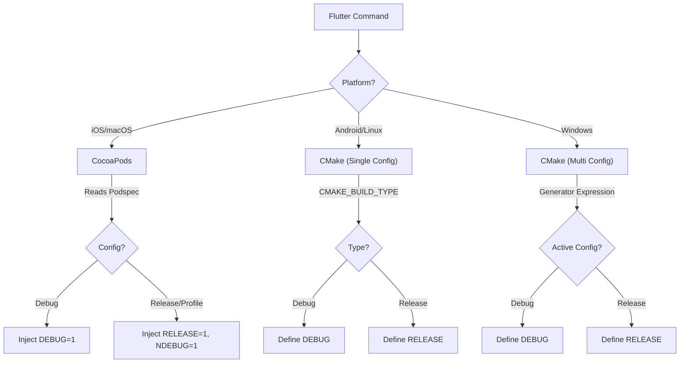

# Build Configuration Guide

This document explains the available build configurations for the `agus_maps_flutter` plugin across all supported platforms. It details how Flutter build modes (Debug, Profile, Release) map to the underlying C++ library configurations and the specific macros used in **branch `release/v0.1.11`**.

## General Concepts

The plugin relies on a shared C++ core (`comaps`). This core has strict compilation requirements:
*   **Debug**: Enables assertions, internal logging, and development checks. Slower performance.
*   **Release**: Optimizes for speed, disables assertions (`NDEBUG`), and strips debug symbols.
*   **Profile**: In this plugin, **Profile builds use Release native binaries** to ensure realistic performance metrics, while Flutter retains its own profiling overhead.


## Platform-Specific Configurations

### 1. iOS (`ios/agus_maps_flutter.podspec`)

| Flutter Mode | Xcode Configuration | Macros Injected | Description |
| :--- | :--- | :--- | :--- |
| `flutter run --debug` | `Debug` | `DEBUG=1`<br>`PLATFORM_IPHONE=1` | **Development**: Full logging and safety checks enabled. |
| `flutter run --release` | `Release` | `RELEASE=1`<br>`NDEBUG=1`<br>`PLATFORM_IPHONE=1` | **Production**: Fully optimized. defines `RELEASE` to satisfy `base.hpp`. |
| `flutter run --profile` | `Profile` | `RELEASE=1`<br>`NDEBUG=1`<br>`PLATFORM_IPHONE=1` | **Performance Analysis**: Uses Release native code for accurate timing. |

### 2. macOS (`macos/agus_maps_flutter.podspec`)

| Flutter Mode | Xcode Configuration | Macros Injected | Description |
| :--- | :--- | :--- | :--- |
| `flutter run -d macos --debug` | `Debug` | `DEBUG=1`<br>`PLATFORM_MAC=1`<br>`PLATFORM_DESKTOP=1` | **Development**: Includes macOS desktop-specific debug logic. |
| `flutter run -d macos --release` | `Release` | `RELEASE=1`<br>`NDEBUG=1`<br>`PLATFORM_MAC=1`<br>`PLATFORM_DESKTOP=1` | **Production/App Store**: Optimized for distribution. |
| `flutter run -d macos --profile` | `Profile` | `RELEASE=1`<br>`NDEBUG=1`<br>`PLATFORM_MAC=1`<br>`PLATFORM_DESKTOP=1` | **Performance Analysis**: Uses Release native code. |

### 3. Android (`android/build.gradle` + CMake)

Android configuration is handled automatically by the Android Gradle Plugin (AGP) and CMake.

| Flutter Mode | Gradle Config | CMake Build Type | Macros (Automatic) |
| :--- | :--- | :--- | :--- |
| `flutter run --debug` | `debug` | `Debug` | `DEBUG` |
| `flutter run --release` | `release` | `Release` | `RELEASE`, `NDEBUG` |
| `flutter run --profile` | `profile` | `Release` | `RELEASE`, `NDEBUG` |

*   **Note**: `src/CMakeLists.txt` automatically maps `CMAKE_BUILD_TYPE=Release` to the `RELEASE` macro.

### 4. Windows (`windows/CMakeLists.txt`)

Windows uses MSVC (Visual Studio compiler) which supports multi-configuration generators.

| Flutter Mode | MSVC Config | CMake Generator Expression | Macros (Automatic) |
| :--- | :--- | :--- | :--- |
| `flutter run -d windows --debug` | `Debug` | `$<$<CONFIG:Debug>:...>` | `DEBUG` |
| `flutter run -d windows --release` | `Release` | `$<$<NOT:$<CONFIG:Debug>>:...>` | `RELEASE` |
| `flutter run -d windows --profile` | `Profile` | `$<$<NOT:$<CONFIG:Debug>>:...>` | `RELEASE` |

### 5. Linux (`linux/CMakeLists.txt`)

Linux uses standard CMake with Makefiles or Ninja.

| Flutter Mode | CMake Type | Macros (Automatic) |
| :--- | :--- | :--- |
| `flutter run -d linux --debug` | `Debug` | `DEBUG` |
| `flutter run -d linux --release` | `Release` | `RELEASE` |
| `flutter run -d linux --profile` | `Release` | `RELEASE` |


## 6. Pre-built Binaries & CI/CD Pipeline

A common question is: *"When I download the plugin, do I get Debug or Release binaries?"*

### The Short Answer
**We only distribute RELEASE binaries.**

### The Detailed Explanation
Our CI/CD pipeline (`.github/workflows/devops.yml`) is configured with a global environment variable:
```yaml
env:
  BUILD_TYPE: Release
```
This means all the pre-compiled assets (XCFrameworks, `.so`, `.dll`) attached to GitHub Releases are optimized **Release** builds.

### Implications for your App
When you consume these pre-built binaries (via `AGUS_MAPS_HOME`):

1.  **Running `flutter run --release`**:
    *   **Perfect Match**: Your app is Release, and the native C++ library is Release. Maximum performance.

2.  **Running `flutter run --profile`**:
    *   **Perfect Match**: Your app is Profile, and the native C++ library is Release. Accurate native performance profiling.

3.  **Running `flutter run --debug`**:
    *   **Hybrid State**: Your Flutter app is in Debug mode (Hot Reload enabled, assertions on), but it links against the **Release** version of the C++ map engine.
    *   **Why is this okay?**
        *   The C++ engine is stable and doesn't need to be debugged by most app developers.
        *   It keeps the download size smaller (Debug binaries are huge).
        *   It ensures the map remains fast even while you debug your Dart UI.
    *   **Trade-off**: You cannot step-debug into the C++ map core code. If you need to do that, you must build the plugin **from source** (remove `AGUS_MAPS_HOME` or set up an in-repo build).

### Summary Table: Distribution vs. Usage

| Binary Source | Build Type | Distributed? | Usage Scenario |
| :--- | :--- | :--- | :--- |
| **GitHub Release** | `Release` | ✅ **Yes** | Standard app development, Release, Profile. |
| **GitHub Release** | `Debug` | ❌ **No** | (Too large, rarely needed). |
| **Local Source** | `Debug` | 🛠 **Manual** | Native debugging / Core contribution. |


## 7. Configuration Flow (Technical Details)

When you run a build command, the following flow ensures the C++ library doesn't panic due to missing configuration macros (the "Either Debug or Release" static assertion).    


### The Role of `AGUS_MAPS_HOME`
This environment variable is **configuration-agnostic**. It tells the build scripts where to find the *dependencies* (headers and pre-compiled libraries).
-   It must be set to the path of the downloaded SDK (e.g., `agus-maps-sdk-vX.Y.Z`).
-   If omitted, the build scripts will attempt to fallback to in-repo source or fail if binaries are missing.


## 8. Summary: Platform Behavior Matrix

| Platform | Build System | Detection Mechanism | Configuration Source |
| :--- | :--- | :--- | :--- |
| **iOS** | Xcode (CocoaPods) | **Manual Injection** | `agus_maps_flutter.podspec` |
| **macOS** | Xcode (CocoaPods) | **Manual Injection** | `agus_maps_flutter.podspec` |
| **Android** | Gradle + CMake | **Automatic** | `src/CMakeLists.txt` |
| **Windows**| MSVC + CMake | **Automatic** | `src/CMakeLists.txt` |
| **Linux** | Make/Ninja + CMake | **Automatic** | `src/CMakeLists.txt` |
