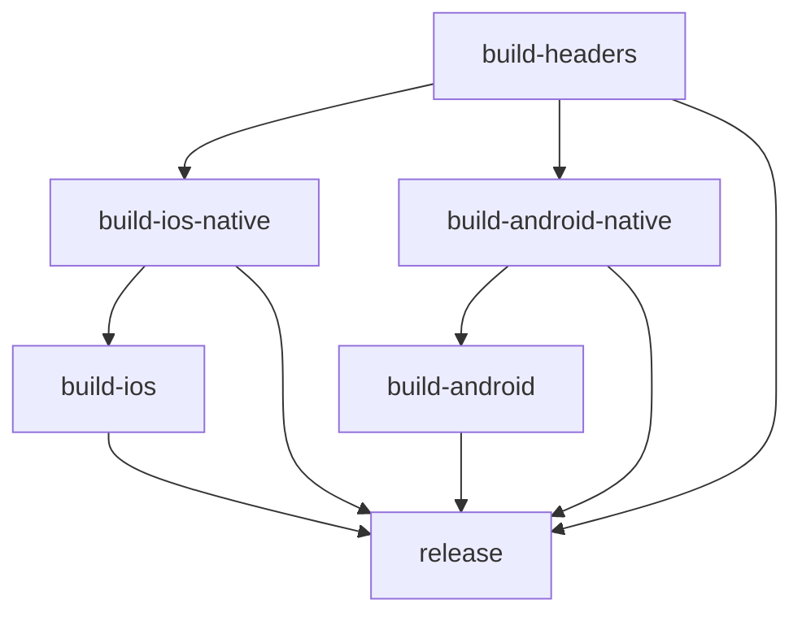

# CI/CD Implementation Plan: Split Native Build + Shared Headers

This document outlines the implementation plan for splitting the Android build process and introducing a shared headers workflow, mirroring the iOS approach for distributing pre-built native libraries via GitHub Releases.

## Overview

### Status Update (v0.1.17+)

The CI pipeline now uses Dart hooks (`tool/build.dart`) as the primary build orchestrator. Legacy bootstrap/build scripts referenced in the historical plan below were removed; only `scripts/build_all.*` and `scripts/bundle_headers.sh` remain as wrappers around the Dart build tool. For the current CI implementation, refer to [.github/workflows/devops.yml](.github/workflows/devops.yml).

### Goals

1. **Split Android build** into two stages: native library build and example app build
2. **Factor out headers bundling** into a dedicated shared workflow
3. **Distribute native libraries via GitHub Releases** (no authentication required for consumers)
4. **Enable plugin consumers** to download pre-built binaries instead of compiling from source

### Artifact Naming Convention

| Artifact | Description | Platforms |
|----------|-------------|-----------|
| `agus-maps-binaries-vX.Y.Z.zip` | **Unified package** with all platform binaries, assets, and headers | All platforms |
| `agus-headers.tar.gz` | Shared C++ headers (included in unified package) | All platforms |

> **Note:** Individual platform zips (`agus-binaries-ios.zip`, `agus-binaries-android.zip`, etc.) are generated as intermediate CI artifacts but are NOT published to GitHub Releases. Only the unified package is published.

### Script Naming Convention (Current)

Most legacy bootstrap/build scripts were removed in favor of Dart hooks. CI and local builds now use the following helpers:

| Script | Purpose |
|--------|---------|
| `tool/build.dart` | Primary build orchestration (bootstrap, patches, data generation, native builds) |
| `scripts/build_all.sh` | Local macOS/Linux build wrapper for Dart hooks |
| `scripts/build_all.ps1` | Local Windows build wrapper for Dart hooks |
| `scripts/bundle_headers.sh` | Bundle shared headers artifact for CI/release packaging |

> **Consumer Note (v0.1.2+):** Consumers should download the unified binary package from GitHub Releases and extract it directly to their Flutter app root. No auto-download scripts are used - the build systems simply detect pre-built binaries.

## Pipeline Architecture

### Build-Release Pipeline Structure

```
build-headers (runs first, produces agus-headers.tar.gz)
├── build-ios-native (depends on build-headers)
│   └── build-ios (depends on build-ios-native)
├── build-android-native (depends on build-headers)
│   └── build-android (depends on build-android-native)
└── release (depends on all builds)
```

### Workflow Dependencies



## Implementation Steps

### Phase 1: Headers Workflow

#### Step 1.1: Legacy rename `bundle_ios_headers.sh` → `bundle_headers.sh`

- Make script platform-agnostic
- Change output path from `ios/CoMaps-headers.tar.gz` to `build/agus-headers.tar.gz`
- Remove iOS-specific references in comments
- Keep same logic for bundling CoMaps + third-party headers

#### Step 1.2: Create `build-headers` workflow in `bitrise.yml`

```yaml
build-headers:
  summary: Bundle CoMaps headers for all platforms
  description: |
    Fetches CoMaps source, applies patches, builds Boost headers,
    and packages all C++ headers into agus-headers.tar.gz.
    This artifact is shared across iOS, Android, and future platforms.
  steps:
    - git-clone
    - Set Environment Variables (COMAPS_TAG)
    - Restore CoMaps Cache
    - Fetch CoMaps Source
    - Save CoMaps Cache
    - Apply CoMaps Patches
    - Build Boost Headers
    - Bundle Headers (bundle_headers.sh)
    - Prepare Headers Artifact
    - deploy-to-bitrise-io (intermediate file: HEADERS_PATH)
```

### Phase 2: iOS Build Refactoring

#### Step 2.1: Use Dart build tool for iOS XCFramework

- Run `dart run tool/build.dart --build-binaries --platform ios`
- Output: `build/agus-binaries-ios/CoMaps.xcframework`

#### Step 2.2: Refactor `build-ios-xcframework` → `build-ios-native` workflow

- Add `depends_on: build-headers`
- Remove headers bundling steps (now in `build-headers`)
- Update build step to call `dart run tool/build.dart --build-binaries --platform ios`
- Output `agus-binaries-ios.zip` (containing `CoMaps.xcframework`)
- Update env var from `XCFRAMEWORK_PATH` to `IOS_BINARIES_PATH`

### Phase 3: Android Native Build

#### Step 3.1: Use Dart build tool for Android binaries

Use `dart run tool/build.dart --build-binaries --platform android`, which:
1. Iterates over ABIs: `arm64-v8a`, `armeabi-v7a`, `x86_64`
2. Invokes CMake with Android NDK toolchain for each ABI
3. Builds CoMaps static libraries (`.a` files)
4. Packages all libraries into `build/agus-binaries-android.zip`

Structure of `agus-binaries-android.zip`:
```
agus-binaries-android/
├── arm64-v8a/
│   ├── libmap.a
│   ├── libplatform.a
│   ├── libcoding.a
│   ├── libgeometry.a
│   ├── libbase.a
│   ├── libdrape.a
│   └── libdrape_frontend.a
├── armeabi-v7a/
│   └── (same .a files)
└── x86_64/
    └── (same .a files)
```

#### Step 3.2: Create `build-android-native` workflow

```yaml
build-android-native:
  summary: Build CoMaps native libraries for Android
  description: |
    Builds CoMaps C++ libraries for Android (all ABIs) and packages
    them into agus-binaries-android.zip for distribution.
  depends_on:
    - build-headers
  steps:
    - git-clone
    - Set Environment Variables (COMAPS_TAG, NDK_VERSION, CMAKE_VERSION)
    - Install Android SDK Components (NDK & CMake)
    - Restore CoMaps Cache
    - Fetch CoMaps Source
    - Save CoMaps Cache
    - Apply CoMaps Patches
    - Build Boost Headers
    - Build Android Native Libraries (dart run tool/build.dart --build-binaries --platform android)
    - Prepare Android Binaries Artifact
    - deploy-to-bitrise-io (intermediate file: ANDROID_BINARIES_PATH)
```

### Phase 4: Manual Binary Distribution (v0.1.3+)

> **Note (v0.1.3+):** Auto-download scripts have been removed. The unified binary package is downloaded manually by consumers before building.

The CI/CD pipeline creates a unified binary package containing all platform binaries:

### Phase 5: Consumer Integration

#### Step 5.1: Update `android/build.gradle`

Configure detection-only logic:
1. Detect if binaries exist in `android/prebuilt/`
2. Fail with clear error if not found, directing users to download
3. No network calls during build

#### Step 5.2: Update `src/CMakeLists.txt`

Add detection logic (no download):
```cmake
option(USE_PREBUILT_COMAPS "Use pre-built CoMaps libraries" OFF)

if(USE_PREBUILT_COMAPS)
    # Link pre-built static libraries
    set(PREBUILT_DIR "${CMAKE_CURRENT_SOURCE_DIR}/../android/prebuilt/${ANDROID_ABI}")
    # ... link libraries from PREBUILT_DIR
else()
    # Existing source build
    add_subdirectory(../thirdparty/comaps build/comaps)
endif()
```

#### Step 5.3: Update `ios/agus_maps_flutter.podspec`

> **Note (v0.1.3+):** The `prepare_command` approach has been removed. Consumers must manually download and extract the unified binary package before running `pod install`.

Update artifact references to use the unified package naming convention.

### Phase 6: App Build Workflow Refactoring

#### Step 6.1: Refactor `build-ios` workflow

- Add `depends_on: build-ios-native`
- Pull headers from intermediate files (or download)
- Pull iOS binaries from intermediate files (or download)
- Build example app using pre-built native libs

#### Step 6.2: Refactor `build-android` workflow

- Add `depends_on: build-android-native`
- Pull headers from intermediate files (or download)
- Pull Android binaries from intermediate files (or download)
- Remove CoMaps source fetch steps (no longer needed)
- Build example app using pre-built native libs

### Phase 7: Release Workflow Update

#### Step 7.1: Update `release` workflow

Update `files_to_upload`:
```yaml
files_to_upload: |-
    $AAB_PATH
    $APK_PATH
    $BUILD_INFO_PATH
    $HEADERS_PATH           # agus-headers.tar.gz
    $IOS_BINARIES_PATH      # agus-binaries-ios.zip
    $ANDROID_BINARIES_PATH  # agus-binaries-android.zip
    $IOS_SIMULATOR_APP_PATH
```

Update release notes to document new artifact names.

#### Step 7.2: Update `build-release` pipeline

```yaml
build-release:
  workflows:
    build-headers: {}
    build-ios-native:
      depends_on:
        - build-headers
    build-android-native:
      depends_on:
        - build-headers
    build-ios:
      depends_on:
        - build-ios-native
    build-android:
      depends_on:
        - build-android-native
    release:
      depends_on:
        - build-headers
        - build-ios-native
        - build-android-native
        - build-ios
        - build-android
```

## Environment Variables

### Build Environment

| Variable | Default | Description |
|----------|---------|-------------|
| `COMAPS_TAG` | `v2026.01.08-11` | CoMaps version tag |
| `FLUTTER_VERSION` | `3.38.7` | Flutter SDK version |
| `NDK_VERSION` | `27.3.13750724` | Android NDK version |
| `CMAKE_VERSION` | `4.2.1` | CMake version |
| `IOS_DEPLOYMENT_TARGET` | `15.6` | iOS minimum version |
| `BUILD_TYPE` | `Release` | Build configuration |

### Intermediate File Variables

| Variable | Artifact |
|----------|----------|
| `HEADERS_PATH` | `agus-headers.tar.gz` |
| `IOS_BINARIES_PATH` | `agus-binaries-ios.zip` |
| `ANDROID_BINARIES_PATH` | `agus-binaries-android.zip` |
| `AAB_PATH` | `agus-maps-android.aab` |
| `APK_PATH` | `agus-maps-android.apk` |
| `IOS_SIMULATOR_APP_PATH` | `agus-maps-ios-simulator.app.zip` |

## Consumer Usage

### For Plugin Consumers (pub.dev, git dependency)

> **Note (v0.1.3+):** Build systems are detection-only. No auto-download occurs during build.

When adding `agus_maps_flutter` to a Flutter project:

1. **Download binaries manually:**
   - Download `agus-maps-binaries-vX.Y.Z.zip` from GitHub Releases
   - Extract directly to your app's root directory

2. **iOS/macOS**: `pod install` expects XCFramework to be present
   - Binaries location: `ios/Frameworks/` or `macos/Frameworks/`

3. **Android**: Gradle expects native libraries to be present
   - Binaries location: `android/prebuilt/{arm64-v8a,armeabi-v7a,x86_64}/`

4. **Windows/Linux**: CMake expects DLL/SO files to be present
   - Binaries location: `windows/prebuilt/x64/` or `linux/prebuilt/x64/`

### For Plugin Developers (in-repo build)

When working on the plugin:
- `thirdparty/comaps` exists → builds from source
- Or download unified package and extract to plugin root

## Platform Support Status

The CI/CD pipeline now supports all major desktop and mobile platforms:

| Platform | Build Tool | Artifact | Status |
|----------|------------|----------|--------|
| Android | `dart run tool/build.dart --build-binaries --platform android` | `agus-binaries-android.zip` | ✅ Implemented |
| iOS | `dart run tool/build.dart --build-binaries --platform ios` | `agus-binaries-ios.zip` | ✅ Implemented |
| macOS | `dart run tool/build.dart --build-binaries --platform macos` | `agus-binaries-macos.zip` | ✅ Implemented |
| Windows | `dart run tool/build.dart --build-binaries --platform windows` | `agus-binaries-windows.zip` | ✅ Implemented |
| Linux | `dart run tool/build.dart --build-binaries --platform linux` | `agus-binaries-linux.zip` | ✅ Implemented |

### GitHub Actions Jobs

| Job | Runner | Platforms Built |
|-----|--------|-----------------|
| `build-and-release-mac-platforms` | `macos-latest` | iOS, macOS |
| `build-and-release-android-platform` | `macos-latest` | Android |
| `build-and-release-windows-platform` | `windows-latest` | Windows |
| `build-and-release-linux-platform` | `ubuntu-latest` | Linux |
| `release` | `ubuntu-latest` | Aggregate & publish |

Headers (`agus-headers.tar.gz`) remain shared across all platforms.

## Migration Notes

### Breaking Changes

1. Artifact names changed to unified versioned format:
   - Individual: `agus-binaries-android.zip`, `agus-binaries-ios.zip`, etc.
   - Unified: `agus-maps-binaries-vX.Y.Z.zip` (contains all platforms)

2. Build tool changes:
  - Legacy `download_libs.sh` has been **removed** (v0.1.3)
  - iOS/macOS/Android/Windows/Linux binaries are now built via `tool/build.dart`
  - `bundle_headers.sh` remains as the CI headers bundling helper

3. Workflow changes:
   - `build-ios-xcframework` → `build-ios-native`
   - Auto-download removed from all build systems

### Backward Compatibility

During transition, the `release` workflow could upload artifacts with both old and new names for one release cycle to prevent breaking existing consumers.

### Patch Application Robustness

The bootstrap and CI scripts now guard simple counters with `((++var)) || true` so they do not trip `set -e` on zero-increment paths. This makes patch application and asset download loops resilient on Linux runners while keeping behavior identical on iOS, Android, macOS, and Windows.

## Checklist

- [x] Create `build-headers` workflow
- [x] Legacy rename `bundle_ios_headers.sh` → `bundle_headers.sh`
- [x] Use `tool/build.dart` for iOS binaries
- [x] Refactor `build-ios-xcframework` → `build-ios-native` workflow
- [x] Use `tool/build.dart` for Android binaries
- [x] Create `build-android-native` workflow
- [x] Remove `download_libs.sh` (v0.1.3 - manual download only)
- [x] Update `android/build.gradle` for detection-only logic
- [x] Update CMakeLists.txt files with detection-only logic
- [x] Update `ios/agus_maps_flutter.podspec`
- [x] Refactor `build-android` workflow
- [x] Refactor `build-ios` workflow
- [x] Update `release` workflow
- [x] Update `build-release` pipeline
- [x] Use `tool/build.dart` for Linux binaries
- [x] Create `build-and-release-linux-platform` workflow (GitHub Actions)
- [x] Update `RELEASE.md` with Linux installation instructions
- [x] Test end-to-end pipeline

## Publishing to pub.dev

The `agus_maps_flutter` package relies on pre-compiled binaries hosted on GitHub Releases. Therefore, a strict order of operations must be followed when publishing a new version to `pub.dev`.

### Prerequisites

- Administrator access to the `agus.app` publisher on `pub.dev`.
- Write access to the GitHub repository to create releases.

### Release Workflow

1.  **Tag and Release**:
    - Ensure the `version` in `pubspec.yaml` matches the tag you intend to create (e.g., `0.0.1`).
    - Create a new GitHub Release with the tag `v<version>` (e.g., `v0.0.1`).
    - **Wait for CI/CD**: The "Build and Release" workflow in `.github/workflows/devops.yml` **MUST** complete successfully. It will automatically upload the following assets to the release:
        - `agus-headers.tar.gz`
        - `agus-binaries-ios.zip`
        - `agus-binaries-android.zip`
        - `agus-binaries-macos.zip`
        - `agus-binaries-windows.zip`
        - `agus-binaries-linux.zip` (if available)

2.  **Verify Assets**:
    - Manually verify that all expected zip/tar.gz files are present on the GitHub Release page. If they are missing, `pub publish` will result in a broken package for consumers.

3.  **Publish to pub.dev**:
    - Run the dry run command to catch any issues:
      ```bash
      flutter pub publish --dry-run
      ```
    - If successful, publish the package:
      ```bash
      flutter pub publish
      ```

> **Note (v0.1.3+)**: Consumers must manually download binaries from GitHub Releases before building. The build systems are detection-only and do not auto-download.

