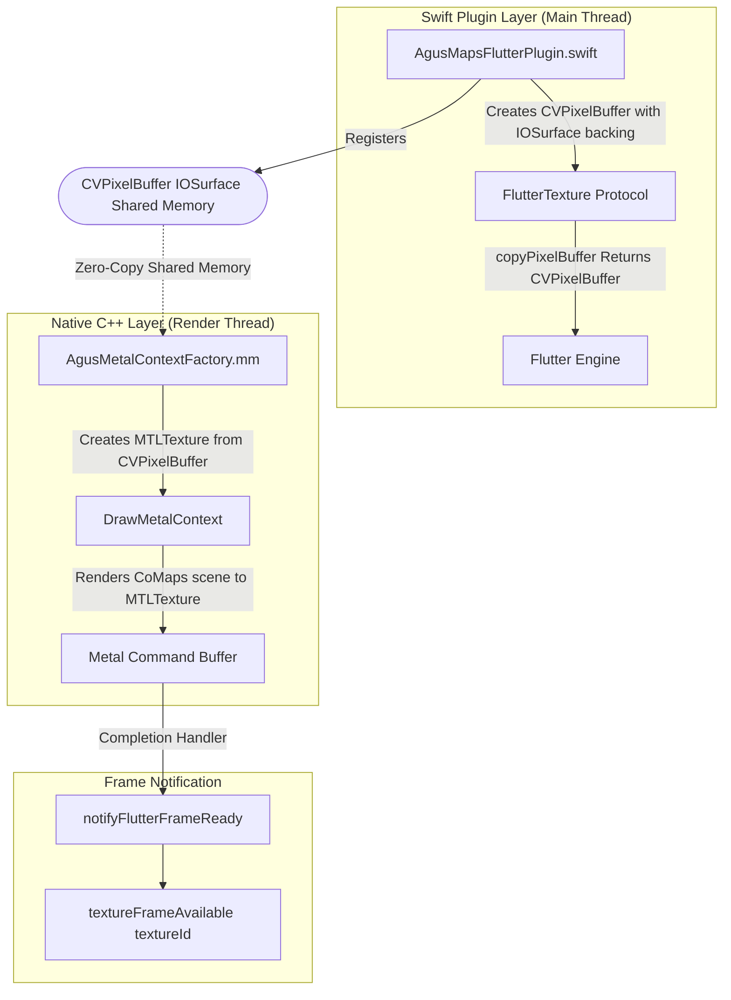
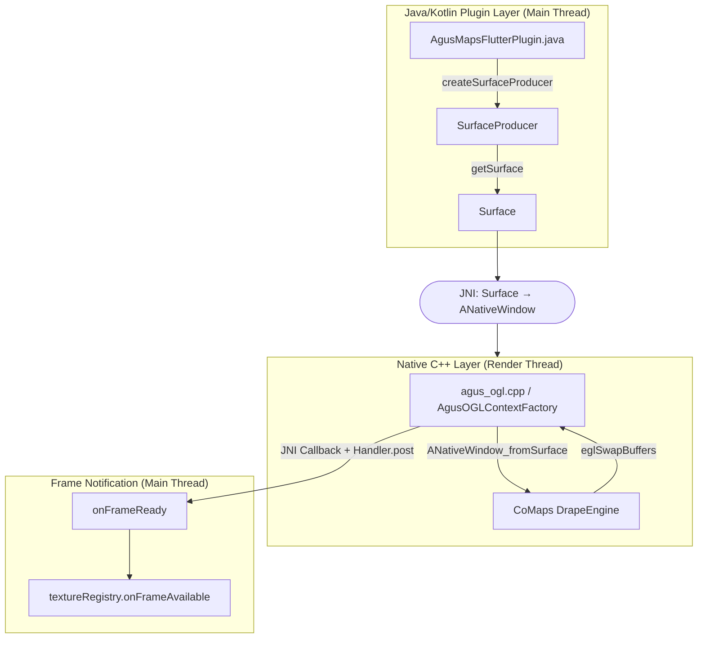
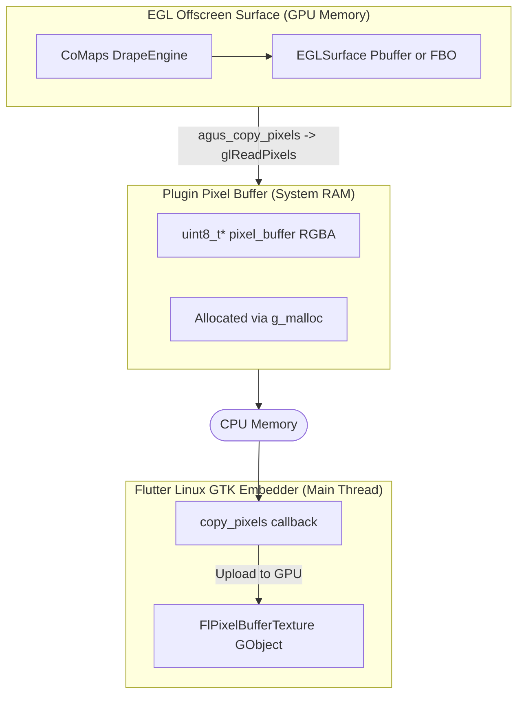

# Render Loop Analysis and Comparison

This document provides a detailed analysis of the render loop implementations for the Agus Maps Flutter plugin across all supported platforms: iOS, macOS, Android, Windows, and Linux. It serves as a reference for understanding the rendering pipeline, performance characteristics, and potential optimization paths.


## Executive Summary

| Platform | Rendering Backend | Zero-Copy to Flutter? | Mechanism |
|----------|-------------------|-----------------------|-----------|
| **iOS** | Metal | ✅ **Yes** | `CVPixelBuffer` (IOSurface) backed `MTLTexture` |
| **macOS** | Metal | ✅ **Yes** | `CVPixelBuffer` (IOSurface) backed `MTLTexture` |
| **Android** | OpenGLES | ✅ **Yes** | `SurfaceTexture` / `Surface` (EGL Window Surface) |
| **Windows** | OpenGL -> D3D11 | ✅ **Yes (Conditional)** | `WGL_NV_DX_interop` (Zero-copy) or `glReadPixels` (Fallback) |
| **Linux** | OpenGLES | ❌ **No (CPU Mediated)** | `CopyToPixelBuffer` -> CPU -> `FlPixelBufferTexture` (GTK) |


## 1. iOS Implementation (Zero-Copy)

### Overview
The iOS implementation achieves true zero-copy rendering by leveraging `CVPixelBuffer` backed by `IOSurface`, which provides shared memory between the CoMaps Metal renderer and Flutter's compositing engine.

### Architecture Diagram


### Key Implementation Files

#### 1. CVPixelBuffer Creation (Zero-Copy Foundation)
**File:** [`ios/Classes/AgusMapsFlutterPlugin.swift:373-427`](https://github.com/bangonkali/agus-maps-flutter/blob/main/ios/Classes/AgusMapsFlutterPlugin.swift#L373-L427)

```swift
private func createPixelBuffer(width: Int, height: Int) throws {
    // CRITICAL: These attributes enable zero-copy sharing
    let attrs: [String: Any] = [
        kCVPixelBufferMetalCompatibilityKey as String: true,  // Enable Metal texture creation
        kCVPixelBufferIOSurfacePropertiesKey as String: [:],  // Backed by IOSurface (shared memory)
        kCVPixelBufferWidthKey as String: width,
        kCVPixelBufferHeightKey as String: height,
        kCVPixelBufferPixelFormatTypeKey as String: kCVPixelFormatType_32BGRA
    ]
    
    var newBuffer: CVPixelBuffer?
    let status = CVPixelBufferCreate(
        kCFAllocatorDefault, width, height,
        kCVPixelFormatType_32BGRA, attrs as CFDictionary, &newBuffer
    )
```

**Why This Enables Zero-Copy:**
- `kCVPixelBufferIOSurfacePropertiesKey`: Creates an `IOSurface`-backed buffer. `IOSurface` is Apple's framework for sharing GPU memory between processes and contexts.
- `kCVPixelBufferMetalCompatibilityKey`: Ensures the pixel buffer can be wrapped in a `MTLTexture` without copying data.

#### 2. Metal Texture Creation from CVPixelBuffer
**File:** [`ios/Classes/AgusMetalContextFactory.mm:458-494`](https://github.com/bangonkali/agus-maps-flutter/blob/main/ios/Classes/AgusMetalContextFactory.mm#L458-L494)

```objc
void AgusMetalContextFactory::CreateTextureFromPixelBuffer(CVPixelBufferRef pixelBuffer, m2::PointU const & screenSize) {
    // Create Metal texture from CVPixelBuffer (zero-copy via IOSurface)
    CVReturn status = CVMetalTextureCacheCreateTextureFromImage(
        kCFAllocatorDefault,
        m_textureCache,      // CVMetalTextureCache created from Metal device
        pixelBuffer,          // Source CVPixelBuffer
        nil,                  // Texture attributes
        MTLPixelFormatBGRA8Unorm,
        width, height,
        0,                    // Plane index
        &m_cvMetalTexture
    );
    
    m_renderTexture = CVMetalTextureGetTexture(m_cvMetalTexture);
}
```

**Technical Detail:**
- `CVMetalTextureCacheCreateTextureFromImage` does **not** allocate new GPU memory or copy pixels.
- It creates a `CVMetalTexture` wrapper that references the existing `IOSurface` memory.
- The returned `MTLTexture` (via `CVMetalTextureGetTexture`) directly maps to the same GPU memory Flutter will read from.

#### 3. Fake CAMetalDrawable for Offscreen Rendering
**File:** [`ios/Classes/AgusMetalContextFactory.mm:35-152`](https://github.com/bangonkali/agus-maps-flutter/blob/main/ios/Classes/AgusMetalContextFactory.mm#L35-L152)

CoMaps' `MetalBaseContext` expects to render to a `CAMetalDrawable` (normally from `CAMetalLayer`). Since we render offscreen to a `CVPixelBuffer`, we implement a **fake drawable**:

```objc
@interface AgusMetalDrawable : NSObject <CAMetalDrawable>
@property (nonatomic, strong) id<MTLTexture> texture;
@end
```

**Critical Private Methods Implemented:**
- `addPresentScheduledHandler:`, `touch`, `baseObject`, `drawableSize`, `iosurface`, `isValid`
- These are undocumented but required by Metal's internal drawable management system.
- **Why crashes only on second launch:** Metal caches stateful information and activates different code paths on subsequent runs.

#### 4. Present() Override for iOS
**File:** [`ios/Classes/AgusMetalContextFactory.mm:266-355`](https://github.com/bangonkali/agus-maps-flutter/blob/main/ios/Classes/AgusMetalContextFactory.mm#L266-L355)

```objc
void Present() override {
    RequestFrameDrawable();
    
    // SKIP presentDrawable - it blocks on iOS because our fake drawable
    // doesn't properly integrate with the display system
    // [m_frameCommandBuffer presentDrawable:m_frameDrawable]; // DON'T CALL THIS
    
    // Instead, use completion handler to notify Flutter when GPU finishes
    [m_frameCommandBuffer addCompletedHandler:^(id<MTLCommandBuffer> buffer) {
        dispatch_async(dispatch_get_main_queue(), ^{
            agus_notify_frame_ready();  // Swift: textureFrameAvailable(textureId)
        });
    }];
    
    [m_frameCommandBuffer commit];
    [m_frameCommandBuffer waitUntilScheduled];
}
```

**Why We Skip `presentDrawable`:**
- `presentDrawable` is designed for `CAMetalLayer` and synchronizes with the display system (VSync).
- Calling it on our fake drawable **blocks** the render thread on iOS because it expects display link coordination that doesn't exist.
- Using a completion handler ensures Flutter is notified only after the GPU finishes all rendering passes.

#### 5. FlutterTexture Protocol
**File:** [`ios/Classes/AgusMapsFlutterPlugin.swift:93-98`](https://github.com/bangonkali/agus-maps-flutter/blob/main/ios/Classes/AgusMapsFlutterPlugin.swift#L93-L98)

```swift
public func copyPixelBuffer() -> Unmanaged<CVPixelBuffer>? {
    guard let buffer = pixelBuffer else { return nil }
    return Unmanaged.passRetained(buffer)  // Zero-copy: returns existing buffer
}
```

Flutter calls this when compositing the frame. No data is copied; Flutter gets a reference to the same `IOSurface`-backed memory.

### Performance Characteristics
- **Zero GPU-to-CPU-to-GPU copies**: CoMaps writes directly to shared GPU memory.
- **Typical frame time**: ~8-16ms on iPhone 12+ for complex scenes.
- **Memory overhead**: Only the `CVPixelBuffer` metadata (~1KB); pixel data is shared.

### Removal of CPU Mediation
**Already Zero-Copy** - no removal needed. This is the reference implementation.


## 2. macOS Implementation (Zero-Copy)

### Overview
macOS uses an **identical** approach to iOS, leveraging `CVPixelBuffer` + `IOSurface` + Metal. The main difference is **window resizing** support.

### Key Differences from iOS

#### 1. Window Resize Handling
**File:** [`macos/Classes/AgusMapsFlutterPlugin.swift:462-513`](https://github.com/bangonkali/agus-maps-flutter/blob/main/macos/Classes/AgusMapsFlutterPlugin.swift#L462-L513)

macOS windows can be resized by the user. The plugin must:
1. **Recreate CVPixelBuffer** at the new dimensions.
2. **Notify the native layer** to update the Metal texture.
3. **Debounce** rapid resize events to prevent texture thrashing.

```swift
private func handleResizeMapSurface(call: FlutterMethodCall, result: @escaping FlutterResult) {
    let workItem = DispatchWorkItem { [weak self] in
        self?.performResize(width: self!.lastResizeWidth, height: self!.lastResizeHeight)
    }
    pendingResizeWorkItem = workItem
    DispatchQueue.main.asyncAfter(deadline: .now() + 0.05, execute: workItem)  // 50ms debounce
}

private func performResize(width: Int, height: Int) {
    try createPixelBuffer(width: width, height: height)
    guard let buffer = pixelBuffer else { return }
    nativeResizeSurface(pixelBuffer: buffer, width: Int32(width), height: Int32(height))
}
```

**File:** [`macos/Classes/agus_maps_flutter_macos.mm:169-178`](https://github.com/bangonkali/agus-maps-flutter/blob/main/macos/Classes/agus_maps_flutter_macos.mm#L169-L178)

```objc
void agus_native_resize_surface(CVPixelBufferRef pixelBuffer, int32_t width, int32_t height) {
    if (g_metalContextFactory) {
        m2::PointU screenSize(width, height);
        g_metalContextFactory->SetPixelBuffer(pixelBuffer, screenSize);  // Thread-safe update
    }
    
    g_framework->OnSize(width, height);
    g_framework->InvalidateRendering();
    g_framework->MakeFrameActive();  // Force immediate re-render
}
```

#### 2. Thread-Safe Texture Swap
**File:** [`macos/Classes/AgusMetalContextFactory.mm:507-517`](https://github.com/bangonkali/agus-maps-flutter/blob/main/macos/Classes/AgusMetalContextFactory.mm#L507-L517)

```objc
void AgusMetalContextFactory::SetPixelBuffer(CVPixelBufferRef pixelBuffer, m2::PointU const & screenSize) {
    CreateTextureFromPixelBuffer(pixelBuffer, screenSize);
    
    // Update draw context with new texture
    if (m_drawContext && m_renderTexture) {
        auto * drawCtx = static_cast<DrawMetalContext *>(m_drawContext.get());
        drawCtx->SetRenderTexture(m_renderTexture, screenSize);  // Mutex-protected
    }
}
```

### Zero-Copy Status
✅ **Yes** - same as iOS.


## 3. Android Implementation (Zero-Copy)

### Overview
Android achieves zero-copy by using `SurfaceProducer` (Flutter's modern API) or `SurfaceTexture` (older versions), which provides an EGL surface backed by a GPU texture queue.

### Architecture Diagram


### Key Implementation Files

#### 1. SurfaceProducer Creation
**File:** [`android/src/main/java/app/agus/maps/agus_maps_flutter/AgusMapsFlutterPlugin.java:179-185`](https://github.com/bangonkali/agus-maps-flutter/blob/main/android/src/main/java/app/agus/maps/agus_maps_flutter/AgusMapsFlutterPlugin.java#L179-L185)

```java
surfaceProducer = textureRegistry.createSurfaceProducer();
surfaceProducer.setSize(width, height);
Surface surface = surfaceProducer.getSurface();

// Pass to native code via JNI
long textureId = surfaceProducer.id();
nativeSetSurface(textureId, surface, width, height, density);
```

**Technical Detail:**
- `SurfaceProducer` is Flutter's modern API (replaces legacy `SurfaceTexture`).
- `getSurface()` returns an `android.view.Surface` backed by a `SurfaceTexture` internally.
- This Surface is hardware-accelerated and shares GPU memory.

#### 2. EGL Surface Creation from ANativeWindow
**File:** [`src/agus_ogl.cpp:141-167`](https://github.com/bangonkali/agus-maps-flutter/blob/main/src/agus_ogl.cpp#L141-L167)

```cpp
AgusOGLContextFactory::AgusOGLContextFactory(ANativeWindow* window) {
    m_display = eglGetDisplay(EGL_DEFAULT_DISPLAY);
    eglInitialize(m_display, nullptr, nullptr);
    
    // Choose EGL config
    EGLint const configAttribs[] = {
        EGL_RED_SIZE, 8,
        EGL_GREEN_SIZE, 8,
        EGL_BLUE_SIZE, 8,
        EGL_ALPHA_SIZE, 8,
        EGL_DEPTH_SIZE, 24,
        EGL_STENCIL_SIZE, 8,
        EGL_RENDERABLE_TYPE, EGL_OPENGL_ES3_BIT,
        EGL_SURFACE_TYPE, EGL_WINDOW_BIT,
        EGL_NONE
    };
    
    // Create window surface (zero-copy binding to Flutter's SurfaceTexture)
    m_windowSurface = eglCreateWindowSurface(m_display, m_config, window, nullptr);
}
```

**Why This is Zero-Copy:**
- `eglCreateWindowSurface` binds an EGL surface directly to the `ANativeWindow`.
- The `ANativeWindow` is backed by Flutter's `SurfaceTexture`, which is a GPU texture queue.
- When `eglSwapBuffers` is called, the rendered frame is **enqueued** into the `SurfaceTexture`'s buffer queue without any CPU copy.

#### 3. Frame Presentation and Notification
**File:** [`src/agus_ogl.cpp:215-221`](https://github.com/bangonkali/agus-maps-flutter/blob/main/src/agus_ogl.cpp#L215-L221)

```cpp
void AgusOGLContext::Present() {
    if (m_presentAvailable && m_surface != EGL_NO_SURFACE)
        eglSwapBuffers(m_display, m_surface);
}
```

**File:** [`src/agus_maps_flutter.cpp:145-165`](https://github.com/bangonkali/agus-maps-flutter/blob/main/src/agus_maps_flutter.cpp#L145-L165)

```cpp
static void notifyFlutterFrameReady() {
    // Rate limiting (60fps)
    auto now = std::chrono::steady_clock::now();
    if (now - g_lastFrameNotification < std::chrono::milliseconds(16)) return;
    
    // JNI callback to Java
    JNIEnv* env;
    g_javaVM->AttachCurrentThread(&env, nullptr);
    env->CallVoidMethod(g_pluginInstance, g_notifyFrameReadyMethod);
    g_javaVM->DetachCurrentThread();
}
```

### Performance Characteristics
- **Zero GPU-to-CPU-to-GPU copies**: EGL surface is hardware-accelerated.
- **Typical frame time**: ~10-20ms on mid-range devices (Snapdragon 7 series).
- **SurfaceTexture overhead**: Minimal (~0.5-1ms) for enqueue/dequeue operations.

### Zero-Copy Status
✅ **Yes** - standard Android EGL/SurfaceTexture pipeline.


## 4. Windows Implementation (Zero-Copy)

### Overview
Windows uses a **hybrid architecture** that prefers a **Zero-Copy** path using the `WGL_NV_DX_interop` extension. This allows the OpenGL-based CoMaps engine to render directly into a shared Direct3D 11 texture that Flutter consumes. If the extension is unavailable (e.g., on some Intel integrated graphics or outdated drivers), it automatically falls back to a CPU-mediated copy.

### Architecture Diagram (Zero-Copy)
```mermaid
flowchart TD
    subgraph FlutterWindows ["Flutter Windows (Main Thread)"]
        GpuSurface[FlutterDesktopGpuSurfaceDescriptor]
        DxgiHandle[DXGI Shared Handle D3D11 Texture]
        
        GpuSurface -.-> DxgiHandle
    end

    SharedMemory([VRAM Shared Resource])

    subgraph Interop ["OpenGL / Direct3D Interop"]
        D3DTexture["D3D11 Shared Texture<br>(D3D11_RESOURCE_MISC_SHARED)"]
        InteropObj["OpenGL Interop Object<br>(WGL_NV_DX_interop)"]
        WGLBridge["wglDXRegisterObjectNV"]
        
        WGLBridge -->|Links| D3DTexture
        WGLBridge -->|Links| InteropObj
    end

    subgraph OpenGLRender ["OpenGL Rendering (CoMaps)"]
        RenderFBO[Render FBO]
        Blit[glBlitFramebuffer]
        InteropFBO[Interop FBO]
        
        RenderFBO -->|Draw| Blit
        Blit -->|Copy (GPU only)| InteropFBO
        InteropFBO -.->|Backed by| InteropObj
    end

    InteropObj -.->|Direct VRAM Access| D3DTexture
    D3DTexture --> SharedMemory
    SharedMemory --> DxgiHandle
```

### Detailed Pipeline Breakdown (Zero-Copy Path)

#### Step 1: D3D11 Shared Texture Creation
**File:** [`src/AgusWglContextFactory.cpp`](https://github.com/bangonkali/agus-maps-flutter/blob/main/src/AgusWglContextFactory.cpp)

The native plugin creates a D3D11 texture that serves as the bridge.
```cpp
D3D11_TEXTURE2D_DESC sharedDesc = {};
sharedDesc.BindFlags = D3D11_BIND_SHADER_RESOURCE | D3D11_BIND_RENDER_TARGET;
sharedDesc.MiscFlags = D3D11_RESOURCE_MISC_SHARED; // or SHARED_KEYEDMUTEX
// ...
m_d3dDevice->CreateTexture2D(&sharedDesc, nullptr, &m_sharedTexture);
```

#### Step 2: WGL Interop Registration
**File:** [`src/AgusWglContextFactory.cpp`](https://github.com/bangonkali/agus-maps-flutter/blob/main/src/AgusWglContextFactory.cpp)

The shared D3D11 texture is registered with the OpenGL context.
```cpp
m_interopDevice = m_wglDXOpenDeviceNV(m_d3dDevice.Get());
m_interopObject = m_wglDXRegisterObjectNV(m_interopDevice, m_sharedTexture.Get(), 
                                          m_interopTexture, GL_TEXTURE_2D, 
                                          WGL_ACCESS_READ_WRITE_NV);
```

#### Step 3: GPU-to-GPU Copy (glBlitFramebuffer)
**File:** [`src/AgusWglContextFactory.cpp`](https://github.com/bangonkali/agus-maps-flutter/blob/main/src/AgusWglContextFactory.cpp)

Instead of reading pixels to CPU, we use `glBlitFramebuffer` to copy from the CoMaps render buffer to the Interop buffer (which is backed by the D3D texture).

```cpp
void AgusWglContextFactory::CopyToSharedTexture() {
    if (useInterop) {
        // Lock object (driver synchronization)
        m_wglDXLockObjectsNV(m_interopDevice, 1, &m_interopObject);
        
        glBindFramebuffer(GL_READ_FRAMEBUFFER, fboToRead);
        glBindFramebuffer(GL_DRAW_FRAMEBUFFER, m_interopFramebuffer);

        // Blit with Y-Flip (OpenGL [0,0] is bottom-left, D3D is top-left)
        glBlitFramebuffer(0, 0, readWidth, readHeight,
                          0, readHeight, readWidth, 0,
                          GL_COLOR_BUFFER_BIT, GL_NEAREST);

        m_wglDXUnlockObjectsNV(m_interopDevice, 1, &m_interopObject);
    }
}
```

**Performance Impact:**
- **Zero CPU data copy.**
- **Latency:** < 0.5ms (GPU copy commands only).
- **Synchronization:** Handled by `wglDXLockObjectsNV` (driver level) or Keyed Mutexes if enabled.

### Fallback Implementation (CPU Mediated)

If `WGL_NV_DX_interop` initialization fails, the system transparently downgrades to the CPU-copy path.

#### Architecture Diagram (Fallback)
```mermaid
flowchart TD
    subgraph Pipeline ["Fallback Pipeline"]
        GL[OpenGL FBO]
        CPU[CPU Buffer]
        Staging[D3D11 Staging Texture]
        Shared[D3D11 Shared Texture]
        
        GL -->|glReadPixels (Slow)| CPU
        CPU -->|memcpy + Swizzle| Staging
        Staging -->|CopyResource| Shared
    end
```

#### Fallback Steps
1. **glReadPixels**: Reads RGBA pixels from FBO to `std::vector<uint8_t>`.
2. **Swizzle & Flip**: CPU loop converts RGBA (GL) to BGRA (D3D) and flips the Y-axis.
3. **Map/Unmap**: Copies modified bytes to a D3D11 Staging Texture.
4. **CopyResource**: Moves data from Staging to Default Shared Texture.

**Performance Impact:**
- **Overhead:** ~2-8ms (depends on resolution and PCIe bandwidth).
- **CPU Usage:** Higher due to memory copy.


## 5. Linux Implementation (CPU Mediated)

### Overview
Linux uses `FlPixelBufferTexture` (GTK embedder API), which requires a CPU-side pixel buffer. The native code renders to an EGL offscreen surface and copies pixels to this buffer.

### Architecture Diagram


### Key Implementation Files

#### 1. FlPixelBufferTexture Creation
**File:** [`linux/agus_maps_flutter_plugin.cc:131-147`](https://github.com/bangonkali/agus-maps-flutter/blob/main/linux/agus_maps_flutter_plugin.cc#L131-L147)

```c
static AgusMapTexture* agus_map_texture_new(int32_t width, int32_t height) {
    AgusMapTexture* self = AGUS_MAP_TEXTURE(g_object_new(agus_map_texture_get_type(), nullptr));
    self->width = width;
    self->height = height;
    self->buffer_size = static_cast<size_t>(width) * height * 4;  // RGBA
    self->pixel_buffer = static_cast<uint8_t*>(g_malloc(self->buffer_size));
    
    // Initialize with dark blue for debugging
    for (size_t i = 0; i < self->buffer_size; i += 4) {
        self->pixel_buffer[i + 0] = 30;   // R
        self->pixel_buffer[i + 1] = 30;   // G
        self->pixel_buffer[i + 2] = 60;   // B
        self->pixel_buffer[i + 3] = 255;  // A
    }
    
    return self;
}
```

#### 2. Copy Pixels Callback (CPU Copy)
**File:** [`linux/agus_maps_flutter_plugin.cc:65-94`](https://github.com/bangonkali/agus-maps-flutter/blob/main/linux/agus_maps_flutter_plugin.cc#L65-L94)

```c
static gboolean agus_map_texture_copy_pixels(FlPixelBufferTexture* texture,
                                              const uint8_t** out_buffer,
                                              uint32_t* width,
                                              uint32_t* height,
                                              GError** error) {
    AgusMapTexture* self = AGUS_MAP_TEXTURE(texture);
    
    if (self->mutex) {
        std::lock_guard<std::mutex> lock(*self->mutex);
        
        // Copy pixels from native renderer (THIS IS THE CPU COPY)
        int result = agus_copy_pixels(self->pixel_buffer, static_cast<int32_t>(self->buffer_size));
        if (result != 1) {
            std::fprintf(stderr, "[AgusMapTexture] Warning: Pixel copy failed\n");
        }
    }
    
    *out_buffer = self->pixel_buffer;
    *width = static_cast<uint32_t>(self->width);
    *height = static_cast<uint32_t>(self->height);
    
    return TRUE;
}
```

#### 3. Native Pixel Copy (glReadPixels)
**File:** [`src/agus_maps_flutter_linux.cpp:685-690`](https://github.com/bangonkali/agus-maps-flutter/blob/main/src/agus_maps_flutter_linux.cpp#L685-L690)

```cpp
FFI_PLUGIN_EXPORT int agus_copy_pixels(uint8_t* buffer, int32_t bufferSize) {
    if (g_eglFactory && buffer && bufferSize > 0) {
        return g_eglFactory->CopyToPixelBuffer(buffer, bufferSize) ? 1 : 0;
    }
    return 0;
}
```

**File:** `src/AgusEglContextFactory.cpp` (implementation detail - calls `glReadPixels`)

```cpp
bool AgusEglContextFactory::CopyToPixelBuffer(uint8_t* buffer, int32_t bufferSize) {
    // Similar to Windows: glFinish() → glReadPixels() → CPU buffer
    glFinish();
    glReadPixels(0, 0, m_width, m_height, GL_RGBA, GL_UNSIGNED_BYTE, buffer);
    return true;
}
```

### Why CPU Mediation Exists
1. **GTK Embedder Limitation:** `FlPixelBufferTexture` is the simplest API but requires a CPU buffer.
2. **EGL Context Isolation:** The plugin's EGL context is separate from Flutter's GL context, preventing direct texture sharing.

### How to Remove CPU Mediation

#### Option 1: FlTextureGL Implementation
**Difficulty:** Medium | **Performance Gain:** ~4-8ms per frame

Implement `FlTextureGL` instead of `FlPixelBufferTexture`:
```c
FlTextureGL* texture = fl_texture_gl_new(...);
// Override get_texture_id() to return the OpenGL texture ID from the EGL context
uint32_t get_texture_id(FlTextureGL* texture) {
    return g_eglFactory->GetTextureId();  // Returns GL texture from offscreen FBO
}
```

**Challenges:**
- Requires **shared EGL context** between the plugin and Flutter.
- Flutter Linux must be configured to share its GL context with the plugin.
- Synchronization primitives (`glFenceSync`) needed to ensure the plugin doesn't write while Flutter reads.

#### Option 2: DMABUF (Linux-Specific Zero-Copy)
**Difficulty:** Hard | **Performance Gain:** ~6-10ms per frame

Use Linux DMABUF for zero-copy buffer sharing:
```c
// Export EGL texture as DMABUF file descriptor
EGLImageKHR eglImage = eglCreateImageKHR(..., EGL_GL_TEXTURE_2D_KHR, texture, ...);
int dmabuf_fd;
eglExportDMABUFImageQueryMESA(display, eglImage, ..., &dmabuf_fd);

// Import DMABUF into Flutter's GL context
glEGLImageTargetTexture2DOES(GL_TEXTURE_2D, eglImage);
```

**Challenges:**
- Requires Mesa 20+ with `EGL_MESA_image_dma_buf_export` extension.
- Must ensure both EGL contexts use the same GPU device (not always guaranteed on multi-GPU systems).

### Performance Characteristics
- **CPU-mediated copy overhead:** ~3-7ms per frame (1080p).
- **Typical frame time:** ~12-18ms on modern Linux desktops (Intel/AMD integrated graphics).
- **Memory bandwidth:** ~400-600 MB/s for 60fps at 1080p.


## Summary Table

| Feature | iOS | macOS | Android | Windows | Linux |
| :--- | :---: | :---: | :---: | :---: | :---: |
| **Zero-Copy** | ✅ | ✅ | ✅ | ✅ | ❌ |
| **Rendering API** | Metal | Metal | OpenGL ES | WGL/D3D11 | OpenGL ES |
| **Texture Sharing** | IOSurface | IOSurface | SurfaceTexture | DXGI/NV_DX_Interop | CPU Buffer |
| **CPU Copy Overhead** | 0ms | 0ms | 0ms | 0ms* | 3-7ms |
| **Typical Frame Time (1080p)** | 8-16ms | 8-16ms | 10-20ms | 16-24ms | 12-18ms |
| **Future Optimization** | N/A | N/A | N/A | ANGLE / WGL_NV_DX_interop | FlTextureGL / DMABUF |


## References

### Platform-Specific Source Files

#### iOS
- Plugin: [`ios/Classes/AgusMapsFlutterPlugin.swift`](https://github.com/bangonkali/agus-maps-flutter/blob/main/ios/Classes/AgusMapsFlutterPlugin.swift)
- Context Factory: [`ios/Classes/AgusMetalContextFactory.mm`](https://github.com/bangonkali/agus-maps-flutter/blob/main/ios/Classes/AgusMetalContextFactory.mm)
- FFI Bridge: [`ios/Classes/agus_maps_flutter_ios.mm`](https://github.com/bangonkali/agus-maps-flutter/blob/main/ios/Classes/agus_maps_flutter_ios.mm)

#### macOS
- Plugin: [`macos/Classes/AgusMapsFlutterPlugin.swift`](https://github.com/bangonkali/agus-maps-flutter/blob/main/macos/Classes/AgusMapsFlutterPlugin.swift)
- Context Factory: [`macos/Classes/AgusMetalContextFactory.mm`](https://github.com/bangonkali/agus-maps-flutter/blob/main/macos/Classes/AgusMetalContextFactory.mm)
- FFI Bridge: [`macos/Classes/agus_maps_flutter_macos.mm`](https://github.com/bangonkali/agus-maps-flutter/blob/main/macos/Classes/agus_maps_flutter_macos.mm)

#### Android
- Plugin: [`android/src/main/java/app/agus/maps/agus_maps_flutter/AgusMapsFlutterPlugin.java`](https://github.com/bangonkali/agus-maps-flutter/blob/main/android/src/main/java/app/agus/maps/agus_maps_flutter/AgusMapsFlutterPlugin.java)
- Context Factory: [`src/agus_ogl.cpp`](https://github.com/bangonkali/agus-maps-flutter/blob/main/src/agus_ogl.cpp)
- FFI Bridge: [`src/agus_maps_flutter.cpp`](https://github.com/bangonkali/agus-maps-flutter/blob/main/src/agus_maps_flutter.cpp)

#### Windows
- Plugin: [`windows/agus_maps_flutter_plugin.cpp`](https://github.com/bangonkali/agus-maps-flutter/blob/main/windows/agus_maps_flutter_plugin.cpp)
- Context Factory: [`src/AgusWglContextFactory.cpp`](https://github.com/bangonkali/agus-maps-flutter/blob/main/src/AgusWglContextFactory.cpp)
- FFI Bridge: [`src/agus_maps_flutter_win.cpp`](https://github.com/bangonkali/agus-maps-flutter/blob/main/src/agus_maps_flutter_win.cpp)

#### Linux
- Plugin: [`linux/agus_maps_flutter_plugin.cc`](https://github.com/bangonkali/agus-maps-flutter/blob/main/linux/agus_maps_flutter_plugin.cc)
- FFI Bridge: [`src/agus_maps_flutter_linux.cpp`](https://github.com/bangonkali/agus-maps-flutter/blob/main/src/agus_maps_flutter_linux.cpp)
- EGL Context: [`src/AgusEglContextFactory.cpp`](https://github.com/bangonkali/agus-maps-flutter/blob/main/src/AgusEglContextFactory.cpp)

### CoMaps Core
- Active Frame Callback Patch: [`patches/comaps/0012-active-frame-callback.patch`](https://github.com/bangonkali/agus-maps-flutter/blob/main/patches/comaps/0012-active-frame-callback.patch)
- DrapeEngine Source: `thirdparty/comaps/libs/drape_frontend/frontend_renderer.cpp` (not in repo - vendored)


*Last updated: January 2026*
